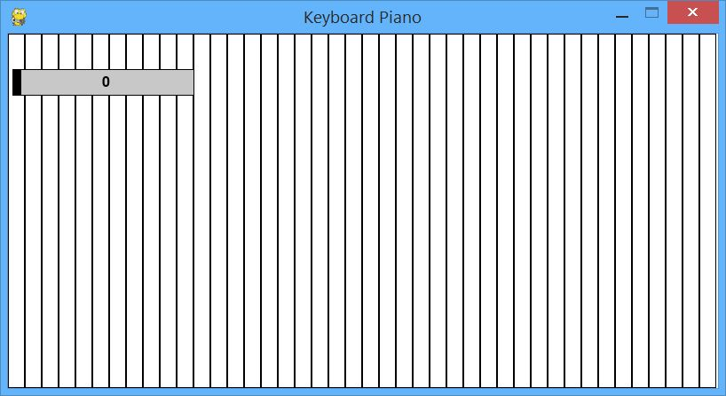
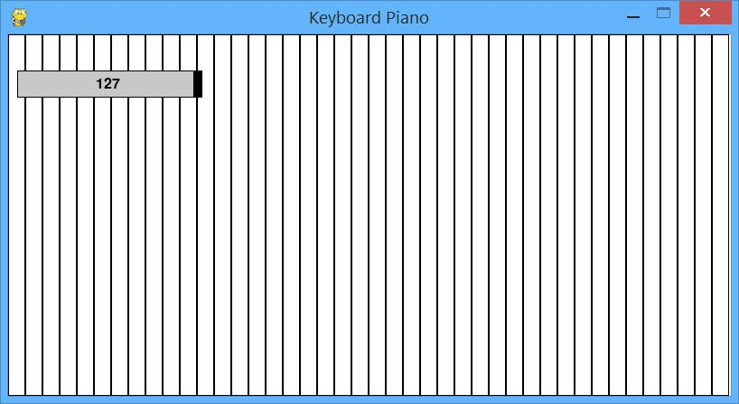

# Python Keyboard Piano

A simple virtual piano application implemented in Python using the Pygame library.

## Introduction

This project implements a virtual piano application using the Pygame library in Python. It allows users to play musical notes using their computer keyboard and supports a variety of MIDI instruments.

The application features:

- Mapping of computer keys to piano keys
- (1, 2, 3...) to the '=' key 
- (q,w,e,r...) to the ']' key 
- (a,s,d,f...) to the ''' key 
- (z,x,c,v...) to the 'm' key
- MIDI output for generating musical notes
- Slider menu to select MIDI instrument
- Interactive piano keys that light up when pressed (lights up a bar in red)

## Installation
### [Download Here](https://github.com/JollyShmo/Python-Keyboard-Piano/archive/refs/heads/main.zip)
1. Ensure you have Python 3.x installed on your system.
2. Install the Pygame library by running the following command:
`pip install pygame`

4. Unzip `Python-Keyboard-Piano-main.zip`

5. Run the application:
`python Piano.py` or open the file `Piano.py`

## Usage

- Use the computer keyboard to play the piano keys. The mapping of keys to notes is defined in the code.
- Use the left and right arrow keys to navigate through the instrument selection menu.
- Click and drag the slider to choose the desired MIDI instrument.

## License

This project is licensed under the [MIT License](LICENSE).

## Contributing

Contributions are welcome! Please feel free to open a pull request or submit an issue for any bugs, feature requests, or enhancements.

## Acknowledgements

- Pygame: https://www.pygame.org/
- MIDI: https://www.midi.org/

